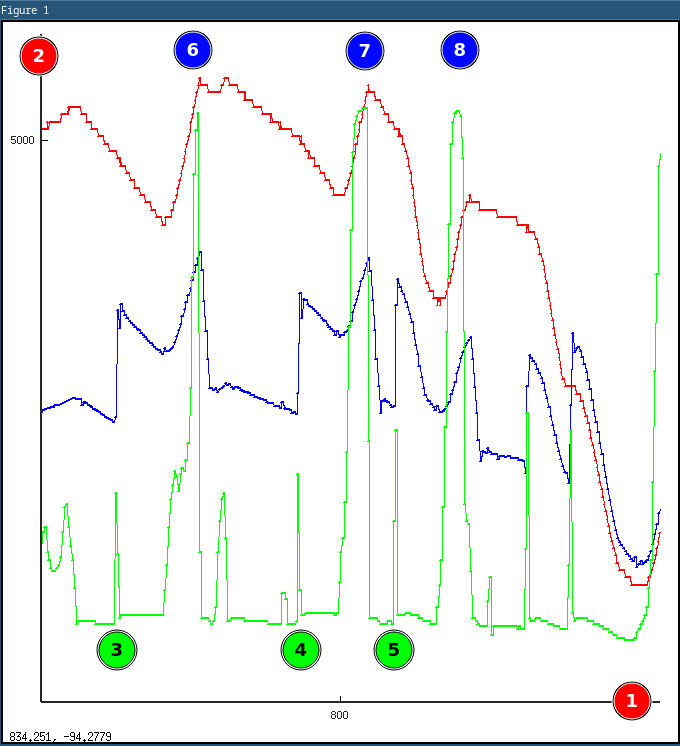

# Live Collection of Driving Data Using a Cheap OBDII-USB Adapter and Offline Analysis

# Abstract

The author builds a machine to examine just how badly he changes gear.

# Warning

Cars are about the most dangerous machines which most of us will
use. Always drive safely and with consideration to other road users. Never
interact with electronic devices while you are driving.

This document outlines a way of collecting data from your cars OBD
interface.  If you connect anything to that interface you must ensure
that it does not hamper your ability to drive. All cabling, etc. must
be clear of the controls which you use.

Having a screen visible to the driver is illegal and dangerous. Make
sure that you cannot see any screen output while driving.

# Background

Modern cars are pleasant to drive and have been engineered to be well
mannered and undemanding. Many people have no trouble at all driving a
car with a manual (stick shift) transmission.

## Typical Manual Car Drive Train

For those who are interested. The output shaft of the engine in a
manual transmission car is connected, via a clutch, to a gearbox and
the output of that typically passes through a differential gear and then
drives the wheels. The clutch allows the driver to disconnect the engine
from the rest of the drive train while gear selections are made. Selecting
gears is somewhat more complicated if the driver decides not to operate
the clutch as elements of the drive train need to be rotating at close
to the same speed before gears can be engaged.

See: https://en.wikipedia.org/wiki/Manual_transmission

## Rev Matching

Althought it's by no means necessary, you can attempt to align the 
engine speed to the rest of the drive train as you shift gears. This 
is often referred to as rev matching.

If you pay attention you'll notice that, at least on up shifts,
drivers naturally allow this to happen. They depress the clutch, wait
for the engine revs to decrease and then take their foot off the clutch at
the point where the revs more or less match the road speed in the next,
higher gear. Failing to do that is pretty conspicuous, the car jolts as
the energy in the engine is absorbed by the clutch. It's not pleasant.

You can do the same thing for down shifts by quickly blipping the throttle
when the clutch is depressed during the shift. I think that it's fair to
say that most people won't bother with that. If you change down at low
engine speeds and and very gently raise the clutch after selecting the
lower gear there's little to chose between the two methods. I suspect
that if you make a poor job of the rev-matching then the result is
worse for the car, anyway.

To summarise, this refinement is pretty pointless in modern cars.

## Motivation

I'm interested, and I like graphs.

# Safety

Do not to experiment with unfamiliar driving techniques on the open road
or anywhere near other road users or pedestrians. Also see the warning
above.

# Experiment

## Equipment

All modern cars are equipped with an OBD interface, I think it may be
a legal requirement. Garages use these to diagnose faults and to clear
the warnings which you sometimes see on the dashboard.

There are a set of standard parameters which must be available on this 
interface including RPM, Road Speed and Throttle Position. There are 
many more, see: https://en.wikipedia.org/wiki/OBD-II_PIDs

It's not really important to understand this interface, only that it's 
possible to access the parameters using low cost hardware which can 
interface to your computer: https://en.wikipedia.org/wiki/ELM327

As I understand it, this ubiquitous device - available for around 20 GBP
is cloned version of a product from "ELM Electronics".  The main device
is a PIC and by some misfortune a product was released without locked
firmware. Since then, cheap clones dominate.

https://cdn.sparkfun.com/assets/learn_tutorials/8/3/ELM327DS.pdf

That contains all the gory details.

Some ELM327 devices support Bluetooth connections but as a Linux user
that just sounds like one more problem.

I selected a USB connected variant - when I plug that into my computer 
it looks like a serial port. Internally there's a CH341 serial controller 
which seems quite like the more common FTDI device. Either way, nobody 
cares: it's a serial device.

For reasons which are lost in the mists of time, the ELM327 use AT commands, 
like an old fashioned serial modem. I see to recall the AT characters allowed 
auto baud detection but this really doesn't seem to happen here.

Oh, and a car. In my case a completely standard 1.2 L hatchback, a few years old.

## Absolutely Minimal Software

So the ELM327 does all the difficult interfacing work - we just need to
ask for some standard readings, RPM, Road Speed and Throttle Position. At
some point I'd be interested in things like brake line pressure, clutch
switch, etc. - not a standard parameter but perhaps available with some
digging ...

I use Debian, BTW :-)

### Expect, for all your serial port needs

Tcl is a maligned programming language. I find it a bit dated and
difficult to use but the Expect language extension is a jewel! There is
nothing better for making simple scripts to drive interactive programs. I
have an uneasy feeling that if you dig deep enough into any complex and
diverse system there will be a small chunk of Expect fulfilling a critical
role. Except nuclear power stations. I'm sure that they don't do that.

    #!/usr/bin/expect

    set modem /dev/ttyUSB0

    stty -F $modem 38400 cs8 -parenb -cstopb

    spawn -open [open $modem w+]
    send "\r"                          # Send a carriage return to sync up
    expect ">"
    send "AT Z\r"                      # Reset the device
    expect ">"
    send "AT Z\r"                      # Hell, do it again, why not?
    expect ">"
    send "AT SP6\r"                    # My car needs this, the protocol autodetect AT SP0 did not work
    expect ">"
    sleep 0.1                          # Wait a bit, probably not needed
    while { 1 } {
        send "010C0D11\r"              # Spam the read command out for RPM, Speed and Throttle position
        expect ">"
    }

That's it!

### Running the command and capturing the output

But you'll want to timestamp and record the output for subsequent analysis:

    sudo stdbuf -oL ./elm327.exp | ts %.s | tee capture

So breaking that down. 

* It's sudo, so that it can interact with the serial port.  Maybe I should add myself to dialup? 
* Then stdbuf -oL only buffers lines, I'm going to timestamp the lines so I don't want any silly stdout caching ... 
* Our old friend ts %.s puts microsecond epoch times on all the lines. 
* Then tee - so we can see something is happening (but we won't be looking when the car is switched on).
* Into a file called capture

Before I go any further I need to point out that the computer screen was
not visible from my driving position and the long USB cable run was away
kept away from the pedal box and the steering wheel.

### What is in the capture?

Here's a fragment of the output file:

    :; strings capture | head -10000 | tail -10
    1739112303.678720 >010C0D11
    1739112303.678947 0: 41 0C 29 46 0D 14
    1739112303.686441 1: 11 32 00 00 00 00 00
    1739112303.724269
    1739112303.736701 >010C0D11
    1739112303.746643 0: 41 0C 29 46 0D 14
    1739112303.746883 1: 11 32 00 00 00 00 00
    1739112303.784179

Using strings, because there are some weird control characters and
garbage which I don't want.

But you can see that it's essentially the >010C0D11 request, followed
by the result - spread over a couple of numbered lines.

I note that the readings are latched at 10 Hz, I think that is a minimum
OBD requirement. It would be nice to speed that up but I do not know how 
to.

### Analysis

Hexadecimal values are nice, but we really want numbers ... Something which can 
go into Octave, for example.

So, this:

    strings capture | grep [01]: | paste -d' ' - - | tr -s ' ' | cut -d' ' -f1,3-8,11- | cut -d' ' -f1,4-5,7,9 | gawk '{printf("%s %d %d %d\n", $1, strtonum("0x"$2$3) / 4, strtonum("0x"$4),strtonum("0x"$5));}' > out

In stages:

* Control characters deleted using strings
* Only interested in the output lines which contain line number and colon
* Paste those lines in pairs
* Squish out the line number and redundant time stamp
* Cut again to get the actual hex bytes corresponding to the readings
* Use awk to turn the hexadecimal into decimal and while we're at it divide the confusing RPM value by 4 (because my car does not have an F1 engine and really can't do 20000 RPM).

### Graphs

Let's use Octave!

    octave:1> load out % Load the file
    octave:2> out(:,1)-=out(1,1); % Make the times relative to the first sample
    octave:3> clf;hold on;plot(out(:,1),out(:,2),'.b-');plot(out(:,1),out(:,3)/1.609344*100,'.r-');plot(out(:,1),out(:,4)/256*6000,'.g-') % Plot the data, all on the same graph

So:

* Blue is RPM
* Red is MPH * 100
* Green is throttle position

# Annotated Sample Plot

(1) Seconds

(2) Combined axes

(3) .. (5) Downshifts
(6) .. (8) Upshifts

# Observations

Looks as if downshifts (3), (4) match the revs reasonably closely but
there's a slight dwell before I drop the clutch. Should be off the
clutch quicker?

In (5) I think that you can see the roadspeed dropping at a faster rate
after the shift, possibly increased engine breaking but I may have been
on the brakes too ...

# Further Work

Given that I have the road speed and RPM I ought to be able to extract 
the gear and detect gear changes pretty well. I think I can separate those 
out and I'm interested in categorising them.

I'm toying with the idea of just leaving a RPi in the car and recording 
everything.

Perhaps I can add some AI to make snarky remarks when I mess up.

_Oh, nice gear change, Stirling_
